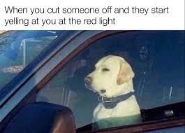
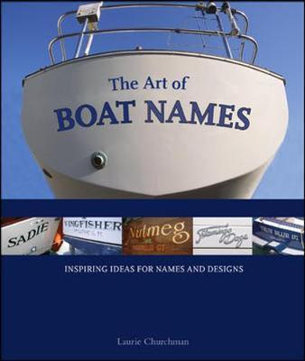

# Last time: linguistic convention

## @lewis_languages_1975 on language

What are *languages*?

- Lewis: collections of pairs of forms and meanings
  - Form: sign, sound, mark, etc.
  - Meaning: set (i.e., collection) of possible states of affairs, things in the world, etc.

::: {.fragment}
What is *language*?

- A human social activity in which people produce certain forms.
:::

## Relating them

Lewis introduces a convention to define language use:

- "...a population P uses a language ξ is a convention of truthfulness and trust in ξ."
  - Truthfulness:
	try never to utter sentences of ξ that are not true in ξ.
  - Trust in ξ:
	impute truthfulness in ξ to others.
	Believe the things that others tell you.

---

## "Language use"

These are *pragmatic* conventions.

::: {.fragment}
What about conventions relating to form?

- syntax, morphology, phonology, phonetics, etc.
- sociolinguistic conventions:
  using a particular register/dialect in particular social setting
:::

---

## Communication and meaning

@grice_meaning_1957: conceptual analysis of the word 'mean'.

(@ex-weather) This rainy weather _means_ we'll probably be taxiing for a while.

(@ex-gesture) Jo's gesture _means_ that she wants you to walk over.

(@ex-beans) "Bo devoured the beans" _means_ that Bo ate the beans aggressively.

---

## Test 1

(@ex-weather) This rainy weather means we'll probably be taxiing for a while, but in fact, we won't be taxiing for a while.

(@ex-gesture) Jo's gesture means that she wants you to walk over, but in fact, she doesn't want you to walk over.

(@ex-beans) "Bo devoured the beans" means that Bo ate the beans aggressively, but in fact, Bo didn't eat the beans aggressively.

---

## Test 2

(@ex-weather) What is meant by this rainy weather is that we'll be taxiing for a while.

(@ex-gesture) What is meant by Jo's gesture is that she wants you to walk over.

(@ex-beans) What is meant by "Bo devoured the beans" is that Bo ate the beans aggressively.

---

## Test 3

(@ex-weather) Someone meant by this rainy weather that we'll probably be taxiing for a while.

(@ex-gesture) Jo meant by her gesture that she wants you to walk over.

(@ex-beans) Someone meant by "Bo devoured the beans" that Bo ate the beans aggressively.

---

## Natural and non-natural meaning

- 'mean' in the @ex-weather examples:
  describes a _consequence_ relation
- 'mean' in the @ex-gesture and @ex-beans examples:
  some other kind of relation

::: {.fragment}
@grice_meaning_1957:
_natural_ meaning vs. _non-natural_ meaning.
:::

---

## Non-natural meaning

### Hypothesis 1

Something _means_$_{NN}$ that $p$ if things of its kind tend to produce a belief in an observer that $p$ is true.

- sun being out makes people believe it's daytime...

---

## Non-natural meaning

### Hypothesis 2

Maybe we should factor in intention.

::: {.fragment}
Someone _means_$_{NN}$ that $p$ by something if they **intend** to use that thing to produce the belief in an audience that $p$ is true.
:::

---

## Counterexample

{fig-align="center"}

---

## Non-natural meaning

### Hypothesis 3

Maybe we should factor in an **intention for one's intention to be recognized**.

::: {.fragment}
Someone _means_$_{NN}$ that $p$ by something if they intend to produce the belief that $p$ in their audience by that thing, and they intend for their intention to be recognized.
:::

---

## Counterexample

Cutting someone off in traffic to make them think you're aggressive and to get them to get out of your way. 

{fig-align="center"}

---

## Non-natural meaning

### What it actually is (according to Grice)

::: {.fragment}
Someone _means_$_{NN}$ that $p$ by something if they intend that:

- their audience comes to believe $p$ because of it,
- their audience recognizes their intention, and
- their audience comes to believe that $p$ specifically *because* of the intention.
:::

---

## Question 1

How to go from "someone meant that $p$ by $X$" to "$p$ means $X$ in a particular linguistic community"?

- Tie in @lewis_languages_1975?

---

## Question 2

How do we characterize meanings for things which aren't statements?

- Commands?
- Questions?

---

# Speech acts

## Some things you can do with words

::: {.fragment}
Make **assertions**:

(@ex-assertion-beans) John devoured the beans.
:::

::: {.fragment}
Ask **questions**:

(@ex-question-beans) How many beans did John devour?
:::

::: {.fragment}
Issue **commands**:

(@ex-command-beans) (Looking John dead in the eye:) Devour the beans!
:::

---

{fig-align="center"}

---

## Construction types

(@ex-assertion-beans) John devoured the beans.
	- declarative sentence
	- assertion

(@ex-question-beans) How many beans did John devour?
	- interrogative sentence
	- question

(@ex-command-beans) Devour the beans!
	- imperative sentence
	- command

---

## Switching up construction types

(@ex-command-beans-declarative) I command you to help me cook the beans!
	- declarative sentence
	- command

(@ex-request-beans-imperative) Please, help me cook the beans...
    - imperative sentence
	- request

(@ex-request-beans-interrogative) Could you please help me cook the beans?
    - interrogative sentence
	- request

---

## Distinguishing types of act

@austin_how_1962 classified speech acts at distinct levels.

- Locutionary act:
  an act of uttering a particular expression.
  - e.g., interrogative vs. imperative vs. declarative
- Illocutionary act:
  an an act of uttering something with a particular intended discourse effect.
  - e.g., question vs. comamand vs. assertion
- Perlocutionary effects:
  the worldly effects an utterance actually has.
  - e.g., question answered, command fulfilled, assertion believed

---

## Illocutionary uptake

An illocutionary act may be successful or unsuccessful.

- Successful if it has the intended social consequence (it has uptake).
- Unsuccessful if it does not have this consequence (it does not have uptake).

---

## Uptakes for different acts

(@ex-bet-uptake) I bet you $300 that it will rain tomorrow.
	- the bet is *accepted*
	
(@ex-command-uptake) Open the window!
	- addressee accepts the obligation to act
	
(@ex-question-uptake) What time is it?
	- addressee accepts the obligation to answer

(@ex-assertion-uptake) It's 1:20pm.
	- addressee accepts (in some sense) the truth of the sentence

---

## Assertions

@stalnaker_assertion_1978 introduces the notion of the *common ground*.

- set of propositions

::: {.fragment}
Uptake of an assertion:

- addressee accepts the meaning of the sentence into the common ground.
:::

---

## Force and content

Illocutionary acts can be characterized along at least two dimensions:

- illocutionary force:
  what kind of intended social effect is involved?
  - assertoric force, imperative force, interrogative force
- content:
  utterance-specific aspects of conveyed meaning
  - assertions:
	sets of possible worlds ("truth conditions")
  - commands:
	"satisfaction conditions"
  - questions:
	"answerhood conditions"

---

## Question about content

Where in the taxonomy of acts does content fall?

- Just the illocutionary act?
- Also locutionary effect?
- (Also perlocutionary effect?)

---

## Performatives

(@ex-command-beans-declarative) I [command]{.underline} you to help me cook the beans!

(@ex-titanic) I hereby [name]{.underline} this ship the R.M.S. Titanic!
	- locutionary act: declarative sentence
	- illocutionary act: naming
	- uptake: ship's name is now 'R.M.S. Titanic'

(@ex-marriage) I [promise]{.underline} to stop moving furniture while you're sleeping.
	- locutionary act: declarative sentence
	- illocutionary act: promise
	- uptake: promise accepted, obligation registered

---

## Peformatives (cont'd)

(@ex-apology) I [apologize]{.underline}.
	- apology
	- uptake: apology accepted

(@ex-marriage) I do.
	- illocutionary act: vow
	- uptake: obligation registered
	
(@ex-bet) I bet you $300 that it will rain tomorrow.
	- illocutionary act: bet
	- uptake: bet accepted
	
---

## Felicity conditions

You can't just perform any speech act haphazardly.

{fig-align="center"}

---

## Felicity conditions

(@ex-apology) I apologize.
	- The speaker should have done something that requires an apology.
	
(@ex-marriage) I do.
	- There should be a vow at stake ("...till death do us part?").
	
(@ex-command) Open the window!
	- The utterer should have the relevant authority.

(@ex-bet) I bet you $300 that it will rain tomorrow.
	- The utterer should have the means to procure $300.

---

## Felicity conditions

In general:

- It must be allowable, by convention, for the speech act to have the illocutionary effect that it is intended to have.
- The circumstances prior to the act have to be appropriate.

---

## Performatives redux

Question 1

- What do performatives and other speech acts have in common?

::: {.fragment}
Question 2

- How does illocutionary effect fit into the distinction of @grice_meaning_1957 between meaning$_{NN}$ and meaning$_{N}$?
:::

---

### References
