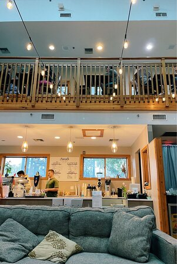
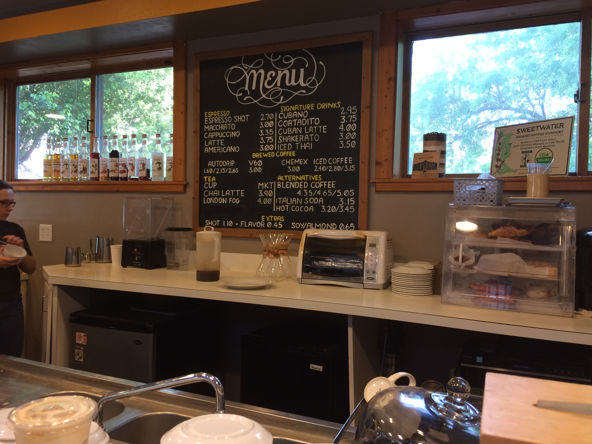
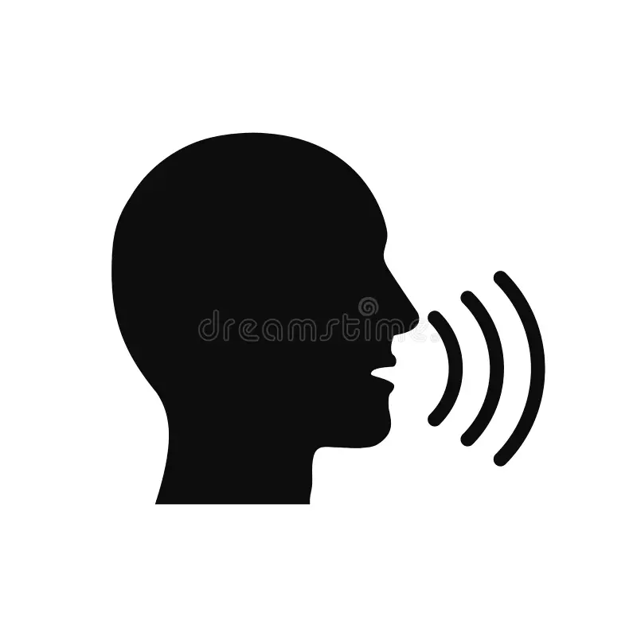

# Speech acts

## Some things you can do with words

::: {.fragment}
Make **assertions**:

(@ex-assertion-beans) John devoured the beans.
:::

::: {.fragment}
Ask **questions**:

(@ex-question-beans) How many beans did John devour?
:::

::: {.fragment}
Issue **commands**:

(@ex-command-beans) (Looking John dead in the eye:) Devour the beans!
:::

---

## Construction types

(@ex-assertion-beans) John devoured the beans.
	- declarative sentence
	- assertion

(@ex-question-beans) How many beans did John devour?
	- interrogative sentence
	- question

(@ex-command-beans) Devour the beans!
	- imperative sentence
	- command

---

## Switching up construction types

(@ex-command-beans-declarative) I command you to help me cook the beans!
	- declarative sentence
	- command

(@ex-request-beans-imperative) Please, help me cook the beans...
    - imperative sentence
	- request

(@ex-request-beans-interrogative) Could you please help me cook the beans?
    - interrogative sentence
	- request

---

## Distinguishing types of act

@austin_how_1962 classified speech acts at distinct levels.

- Locutionary act:
  an act of uttering a particular expression.
  - e.g., interrogative vs. imperative vs. declarative
- Illocutionary act:
  an an act of uttering something with a particular intended discourse effect.
  - e.g., question vs. comamand vs. assertion
- Perlocutionary effects:
  the worldly effects an utterance actually has.
  - e.g., question answered, command fulfilled, assertion believed

---

## Illocutionary uptake

An illocutionary act may be successful or unsuccessful.

- Successful if it has the intended social consequence (it has uptake).
- Unsuccessful if it does not have this consequence (it does not have uptake).

---

## Uptakes for different acts

(@ex-bet-uptake) I bet you $300 that it will rain tomorrow.
	- the bet is *accepted*
	
(@ex-command-uptake) Open the window!
	- addressee accepts the obligation to act
	
(@ex-question-uptake) What time is it?
	- addressee accepts the obligation to answer

(@ex-assertion-uptake) It's 1:20pm.
	- addressee accepts (in some sense) the truth of the sentence

---

## Assertions

@stalnaker_assertion_1978 introduces the notion of the *common ground*.

- set of propositions

::: {.fragment}
Uptake of an assertion:

- addressee accepts the meaning of the sentence into the common ground.
:::

---

## Force and content

Illocutionary acts can be characterized along at least two dimensions:

- illocutionary force:
  what kind of intended social effect is involved?
  - assertoric force, imperative force, interrogative force
- content:
  utterance-specific aspects of conveyed meaning
  - assertions:
	sets of possible worlds ("truth conditions")
  - commands:
	"satisfaction conditions"
  - questions:
	"answerhood conditions"

---

## Question about content

Where in the taxonomy of acts does content fall?

- Just the illocutionary act?
- Also locutionary effect?
- (Also perlocutionary effect?)

---

## Performatives

(@ex-command-beans-declarative) I [command]{.underline} you to help me cook the beans!

(@ex-titanic) I hereby [name]{.underline} this ship the R.M.S. Titanic!
	- locutionary act: declarative sentence
	- illocutionary act: naming
	- uptake: ship's name is now 'R.M.S. Titanic'

(@ex-marriage) I [promise]{.underline} to stop moving furniture while you're sleeping.
	- locutionary act: declarative sentence
	- illocutionary act: promise
	- uptake: promise accepted, obligation registered

---

## Peformatives (cont'd)

(@ex-apology) I [apologize]{.underline}.
	- apology
	- uptake: apology accepted

(@ex-marriage) I do.
	- illocutionary act: vow
	- uptake: obligation registered
	
(@ex-bet) I bet you $300 that it will rain tomorrow.
	- illocutionary act: bet
	- uptake: bet accepted
	
---

## Felicity conditions

You can't just perform any speech act haphazardly.

{fig-align="center"}

---

## Felicity conditions

(@ex-apology) I apologize.
	- The speaker should have done something that requires an apology.
	
(@ex-marriage) I do.
	- There should be a vow at stake ("...till death do us part?").
	
(@ex-command) Open the window!
	- The utterer should have the relevant authority.

(@ex-bet) I bet you $300 that it will rain tomorrow.
	- The utterer should have the means to procure $300.

---

## Felicity conditions

In general:

- It must be allowable, by convention, for the speech act to have the illocutionary effect that it is intended to have.
- The circumstances prior to the act have to be appropriate.

---

## Performatives redux

Question 1

- What do performatives and other speech acts have in common?

::: {.fragment}
Question 2

- How does illocutionary effect fit into the distinction of @grice_meaning_1957 between meaning$_{NN}$ and meaning$_{N}$?
:::

---

---

## More on felicity conditions

- Performatives tend to have felicity conditions.
- What about other types of speech act?

(@ex-lights) Jo: Is Pascal's closed?   Bo: The lights are out.
	- Implies there are lights.
	- (May also imply that Pascal's is closed.)

---

## Presupposition

A well-studied type of felicity condition on speech acts.

 

::: {.fragment}
Apparently affects them uniformly.
:::

(@ex-lights-q) Are the lights are out?

(@ex-lights-imp) Turn out the lights!

::: {.fragment}
Both imply that there are lights.
:::

---

## Aspectual predicates

(@ex-stop-smoking) Jo stopped smoking cigarettes.
	- ↝ Jo used to smoke cigarettes.

(@ex-continue-smoking) Jo continued smoking cigarettes.
	- ↝ Jo used to smoke cigarettes.

---

## More aspectual inferences

(@ex-still-smoking) Jo still smokes cigarettes.
	- ↝ Jo used to smoke cigarettes.

(@ex-yet-smoking) Does Jo smoke cigarettes yet?
	- ↝ Jo is going to smoke cigarettes.

---

## Factive predicates

(@ex-love) Jo loves that Bo stopped smoking.
	- ↝ Bo used to smoke.
	- ↝ Bo stopped smoking.

(@ex-hate) Jo hates that it's raining.
	- ↝ It's raining.

---

## Something weird

(@ex-hate-conditional) If it's raining, then Jo hates that it's raining.
	- ↝ ?

(@ex-still-conditional) If Jo used to smoke cigarettes, then she still does.
	- ↝ ?

::: {.fragment}
Where'd they go?
:::

---

## Summary

Felicity conditions:

- Some kinds of felicity conditions pertain to specific illocutionary act types.
  - commands, bets, apologies, etc.
  
- Other kinds of felicity conditions (presuppositions) seem to cross-cut speech acts. 
  
::: {.fragment style="text-align: center;"}
What could be the locus of this difference?
:::

---

# Speaker meaning

## Overview

Things we've looked at:

- **Things that people do**:
  use expressions of their language to create certain (conventional) social effects.
  - Categorization of illocutionary effects:
	- performative, assertion, question, ...

::: {.fragment}
Things we *haven't* looked at:

- **How they do it**:
  locutionary act → illocutionary act (?)
:::

---

## Strategy

What we need:

- a (systematic, predictive, comprehensive) story about how people use expressions to perform illocutionary acts

::: {.fragment}
We can work backwards.

- Illocutionary act [↓]{.gb-blue}
  - [Locutionary act]{.gb-blue}
	- syntax
	- [semantics]{.gb-green}
:::

---

## Some illocutionary acts

:::: {.columns}

::: {.column width="75%"}

(@ex-relation) **Context**: Jo and Bo are outside Pascal's, looking in the window.   
	**Jo**: No one's at the cash register.  
	**Bo**: The lights are on.  
	- Bo's response:
		- Force: assertion
		- Content, Part 1: **Pascal's lights are on**
		- Content, Part 2: **Pascal's is open**
:::

::: {.column width="25%"}
{width="300px" height="400px"}
:::

::::

---

## Some illocutionary acts

:::: {.columns}

::: {.column width="75%"}

(@ex-ignorance) **Context**: Jo and Bo get inside Pascal's and are now in line.  
	**Jo**: What do you want?  
	**Bo**: Something with lots of caffeine.
	
- ↝ Bo isn't sure what he wants.
:::

::: {.column width="25%"}
{width="300px" height="400px"}
:::

::::

---

## Some illocutionary acts

:::: {.columns}

::: {.column width="75%"}

(@ex-ignorance) **Context**: Bo got an iced matcha latte.  
	**Jo**: How is it?  
	**Bo**: I think it needs at least three more pumps of syrup.
	
- ↝ Bo's thinks his latte is *too sweet*.
:::

::: {.column width="25%"}
{width="300px" height="400px"}
:::

::::

---

## Explaining illocutionary effects

Has two parts:

- the semantics of the expressions
- general rules for mapping the semantics of expressions onto meanings in context

---

## An *extremely* general rule

@grice_logic_1975 proposes the **Cooperative Principle**:

- *"Make your conversational contribution, such as is required, at the stage at which is occurs, by the accepted purpose or direction of the talk exchange in which you are engaged."*

::: {.fragment}
Basic hypotheses:

- Humans are rational agents.
- They are cooperative.
- Meaning arises from principles of rational cooperation.
:::

---

## Maxims

Grice describe four maxims:

- Quality
- Quantity
- Relation
- Manner

---

## Quality

Part 1:
only say that which you believe to be true.

::: {.fragment}
Part 2:
only say that which you have enough evidence for.
:::

 

::: {.fragment}
Who else said something like this?
:::

---

## Quantity

Part 1:
make your contribution as informative as necessary.

::: {.fragment}
Part 2:
don't overdo it.

{width="300px"}
:::

---

## Relation

Make your contribution relevant.

---

## Manner

Four parts:

- Avoid obscurity.
- Avoid ambiguity.
- Be brief.
- Be orderly.

---

## First example

:::: {.columns}

::: {.column width="75%"}

::: {.nonincremental}
(@ex-relation) **Context**: Jo and Bo are outside Pascal's, looking in the window.   
	**Jo**: No one's at the cash register.  
	**Bo**: The lights are on.
		
**Implicature**:
Pascal's is open.

:::

- relation

::: {.fragment}
How? Followed.
:::

:::

::: {.column width="25%"}
{width="300px" height="400px"}
:::

::::

---

## Second example

:::: {.columns}

::: {.column width="75%"}

::: {.nonincremental}
(@ex-ignorance) **Context**: Jo and Bo get inside Pascal's and are now in line.  
	**Jo**: What do you want?  
	**Bo**: Something with lots of caffeine.

**Implicature**:
Bo doesn't know what he wants.
:::

- quality
- quantity

::: {.fragment}
How? Clash.
:::

:::

::: {.column width="25%"}
{width="300px" height="400px"}
:::

::::

---

## Third example

:::: {.columns}

::: {.column width="75%"}

::: {.nonincremental}

(@ex-ignorance) **Context**: Bo got an iced matcha latte.  
	**Jo**: How is it?  
	**Bo**: I think it needs at least three more pumps of syrup.

**Implicature**:
Bo thinks his latte is too sweet.
:::

- quality

::: {.fragment}
How? Flouted.
:::

:::

::: {.column width="25%"}
{width="300px" height="400px"}
:::

::::

---

## A few more

(@ex-quantity) John devoured some of the beans.

 

(@ex-manner-1) Bo walked to his desk, sat down, and got up.

 

(@ex-manner-2) Jo got the car to start.

---

## Questions

1. How should we understand the CP and the maxims?
   - Do they tell us how to behave?

2. How do they fit into Grice's notion of meaning$_{NN}$?
   - Implicatures:
	 just inferred, or genuinely communicated?

3. Variation?

---

### References
